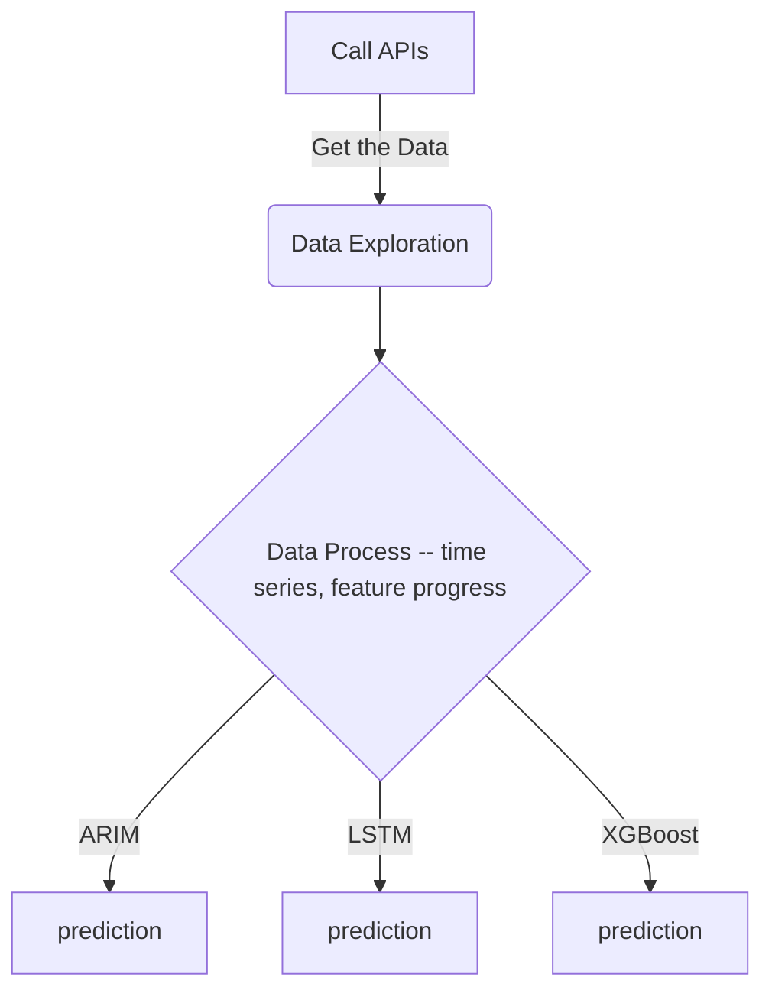

## Stock Analysis (time series analysis)

### Introduction

In this repo, I would love to have practical experience on time-series analysis. One of the common example in time is Financial analysis, specfically stock analysis. data_exploration.py contains everything analyst could do on a time series dataset, like window function, decomposition, adding features, etc. 


In addition, three different Time series models are utilised to predict stock value in the future, because they could recognize the trend and seasonality from the existing observatiosn (the past information) and then forecast a value based on its features. 
Later, three algorithms prediction are compared to see algorithms' feature and begin to know which algorithm could be better for different situations.

### Flow Diagram



## Getting Started

### Prerequisites

```
    Tools Required:
    Visual Studio or Pycharm (Any IDE could run Python)
    Please see requirements.txt (3rd-party packages)
    
```

### Installing

A few libraries needed to install to ensure that the code could run.

Say what the step will be

```
    pip install yfiance
    pip install torch
    pip install statsmodels
```
1. Clone the repository
```
 git clone https://github.com/JamesLi197412/Yahoo-Fiance.git
```

#### Forecast Model

* ARIMA models are effective for capturing linear trends and seasonal patterns.

* LSTM models tends to perform well on time series data with complex patterns and long-term dependencies.

* XGBoost can perform well when dealing with non-linear relationships and interactions among variables.


